```{r setup, include=FALSE}
knitr::opts_chunk$set(echo = TRUE)
```
# Storytelling: Exploring Activity and Calorie Expenditure

## Boxplot of Total Steps by Customers
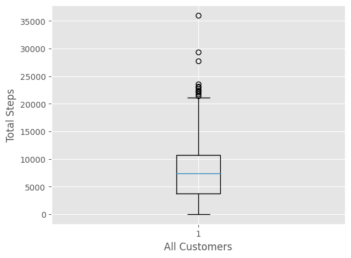
The boxplot illustrates the distribution of total steps taken by all customers. The variation in the distribution suggests that some customers are more active than others.

## Scatter Plot: Steps vs. Calories
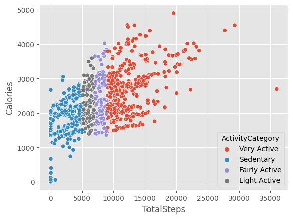
Exploring the correlation between steps and calories burned. The scatter plot reveals a relationship between the two variables, although the correlation is not very strong.

## Total Steps by Day of the Week
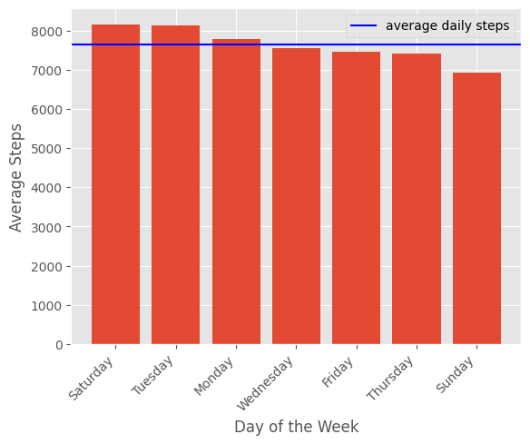
Analyzing total steps taken on different days of the week. A bar plot showcases interesting patterns, such as higher activity levels on Tuesdays and lower levels on Sundays.

## Average Steps per Day of the Week
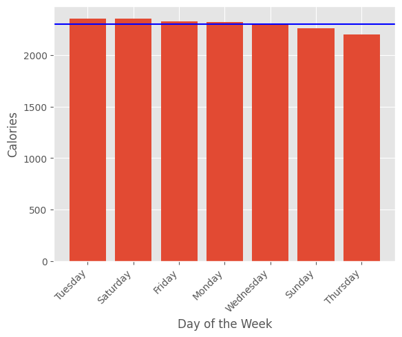
Examining the average steps per day of the week. An upward trend from Saturday to Tuesday is observed, with Monday showing particularly high activity levels.

## Activity Breakdown Pie Chart
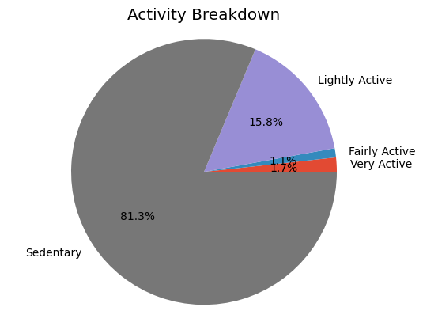
Visualizing the breakdown of activity levels. The pie chart highlights the proportion of time spent in various activity categories, emphasizing the importance of reducing sedentary behavior.

## Regression Analysis: Steps vs. Activity Levels

### Steps vs. Fairly Active Minutes
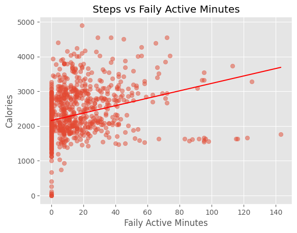

### Steps vs. Very Active Minutes
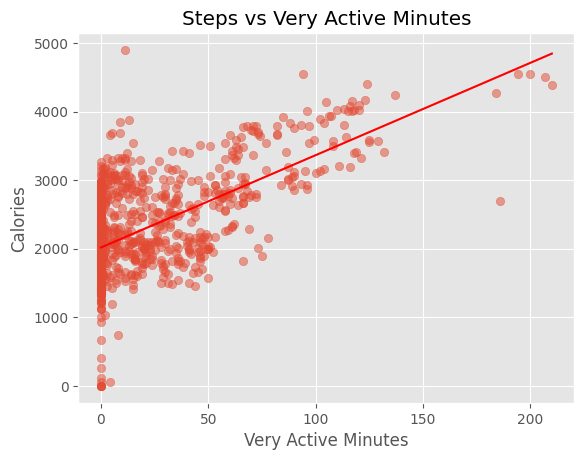

### Steps vs. Lightly Active Minutes
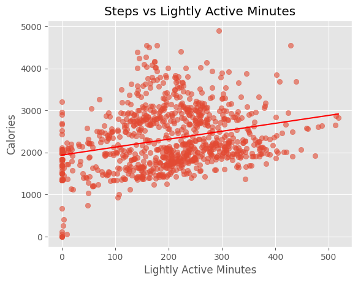

### Steps vs. Sedentary Minutes
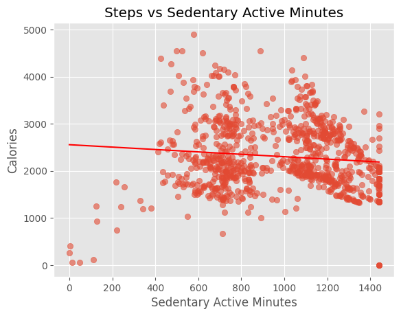

Exploring the relationship between different activity levels and calorie expenditure through regression analysis. Each type of activity correlates with calorie burn, albeit with varying strengths.


## Comparison of Regression Lines
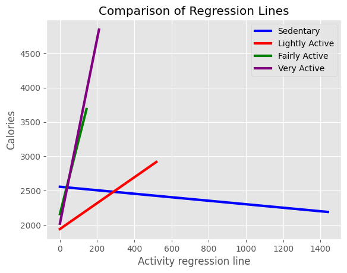
Comparing regression lines for different activity levels. The visualization provides insights into how each type of activity influences calorie expenditure.

## Total Steps vs. Calories
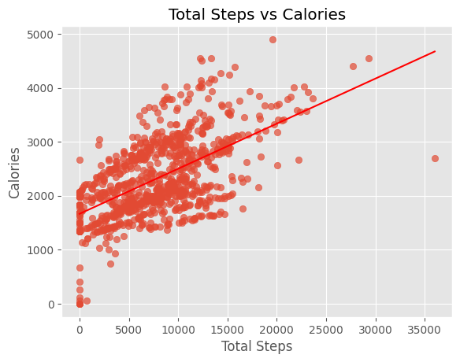
Analyzing the relationship between total steps and calorie expenditure. The scatter plot reveals a linear relationship between the two variables.

## Storytelling
Let's start our story with the first plot, which depicts a boxplot of the number of steps taken by all customers. This visualization tool shows us the distribution of data from the minimum to the maximum number of steps, along with the median and quartiles. In our case, we can observe that this distribution is quite varied, suggesting that some customers take significantly more steps than others.

Moving on to the next plot, we explore the correlation between steps and calories burned. The scatter plot allows us to see if there's any relationship between these two variables. After calculating the Pearson correlation coefficient, we find that the correlation is not very strong. However, it's essential to note that this relationship can also be influenced by the degree of active lifestyle.

Next, we delve into the total steps taken on different days of the week. By grouping the data and summing up the steps, we create a bar plot that reveals interesting patterns. For instance, we notice that Sundays typically have the lowest number of steps, while Tuesdays see the highest activity levels.

Continuing our exploration, we examine the average steps per day of the week. Again, we group the data and calculate the mean steps for each day, displaying them in another bar plot. Interestingly, we observe an upward trend from Saturday to Tuesday, with Monday being particularly active.

Our attention then shifts to the breakdown of activity levels, represented by a pie chart. This visualization shows us the proportion of time spent in different activity categories, such as sedentary, lightly active, fairly active, and very active. It's striking to see that a significant portion of time is spent in sedentary activities, highlighting the importance of promoting more movement.

Moving on to regression analysis, we examine the relationship between various activity levels and calorie expenditure. Through scatter plots and regression lines, we explore how different types of activity correlate with calorie burn. While each type of activity shows a relationship with calorie expenditure, the strength of the correlation varies.

Finally, we conclude our storytelling journey by exploring the average calorie expenditure throughout the week. By grouping the data and calculating the mean calories for each day, we gain insights into how calorie expenditure fluctuates over the course of the week.

This narrative provides a comprehensive overview of the relationship between activity levels, calorie expenditure, and daily patterns, offering valuable insights for understanding and promoting a healthy lifestyle.


## Conclusion
This storytelling journey offers a comprehensive overview of the relationship between activity levels, calorie expenditure, and daily patterns. By analyzing the provided visualizations, valuable insights for understanding and promoting a healthy lifestyle are gained.
